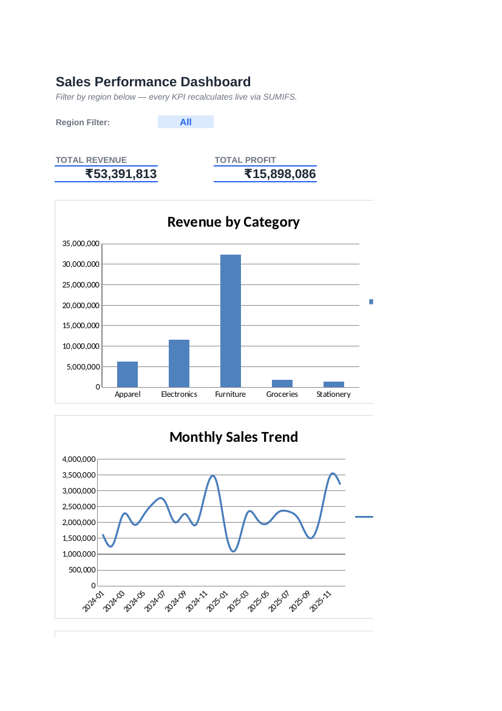

# 📊 Sales Data Analysis & Dashboard

**Analyze historical sales data to identify revenue drivers, seasonal trends, and actionable improvements — with a fully interactive Excel dashboard, a reproducible Python cleaning/analysis pipeline, and a SQL layer for querying the same data.**


---

## 📌 Problem Statement

> Analyze a company's historical sales data to identify key revenue drivers, seasonal trends, and suggest actionable improvements. Visualize insights through an interactive dashboard.

This repo delivers that end-to-end: **raw messy data → cleaned dataset → SQL/Python analysis → interactive Excel dashboard → documented insights.**

---

## 🖼️ Dashboard Preview



More chart previews are in [`screenshots/`](screenshots/) — monthly trend, category/region split, channel performance, top products, and profit margin by category.

---

## 🗂️ Project Structure

```
sales-data-analysis-dashboard/
├── README.md
├── LICENSE
├── requirements.txt
├── .gitignore
│
├── data/
│   ├── sales_data_raw.csv              # Synthetic raw data (messy, on purpose)
│   ├── sales_data_cleaned.csv          # Output of the cleaning pipeline
│   └── sales_data_clean_reference.csv  # Ground-truth generator reference
│
├── python/
│   ├── generate_data.py                # Builds the synthetic sample dataset
│   ├── data_cleaning.py                # Week 1: cleaning & preprocessing pipeline
│   ├── sales_analysis.py               # Week 2: KPIs + chart generation (matplotlib)
│   └── build_excel.py                  # Builds the Excel dashboard workbook
│
├── sql/
│   ├── schema_and_queries.sql          # Table schema + 12 KPI/analysis queries
│   ├── load_to_sqlite.py               # Loads cleaned CSV into sales.db
│   └── sales.db                        # Generated SQLite database
│
├── excel/
│   └── Sales_Dashboard.xlsx            # ⭐ Final interactive Excel dashboard
│
├── screenshots/                        # Chart & dashboard images used in this README
│
└── docs/
    └── kpi_summary.txt                 # Plain-text KPI summary (generated)
```

---

## ✅ Week-wise Plan & Status

| Week | Tasks | Status |
|---|---|---|
| **Week 1** | Collect & clean sample sales data · handle missing data, mixed date formats, categories · explore with pandas/Excel | ✅ Done — `python/data_cleaning.py` |
| **Week 2** | Identify KPIs (Total Sales, Sales by Category, Monthly Trends) · build Excel visualizations · SQL analysis | ✅ Done — `python/sales_analysis.py`, `sql/schema_and_queries.sql` |
| **Mid Project Review** | Documented cleaning steps · functional summary tables · clearly defined KPIs | ✅ Done — this README + `docs/kpi_summary.txt` |
| **Week 3** | Build interactive dashboard · add filter ("slicer") + drill-down · emphasize storytelling | ✅ Done — `excel/Sales_Dashboard.xlsx` (Dashboard sheet) |
| **Week 4** | Finalize & polish dashboard design · summary report of insights · prepare presentation | ✅ Done — Insights section below |
| **Final Review** | Completed dashboard · summary report (findings + recommendations) · screenshots & documentation | ✅ Done |

> **Note on tooling:** the original brief mentions Power BI. This implementation delivers the same outcome — an interactive, filterable dashboard with drill-down visuals — natively in **Excel** (formulas + charts + a filter control) plus a **Python/SQL** analysis layer, so the whole project runs without any paid or platform-specific software. The Excel workbook opens identically in Excel, LibreOffice Calc, and Google Sheets (import).

---

## 🚀 Getting Started

### 1. Clone & install dependencies

```bash
git clone <your-repo-url>
cd sales-data-analysis-dashboard
pip install -r requirements.txt
```

### 2. Reproduce the pipeline (optional — output files are already included)

```bash
# 1. Generate the synthetic raw dataset
python python/generate_data.py

# 2. Clean & preprocess it
python python/data_cleaning.py

# 3. Run KPI analysis + generate chart images
python python/sales_analysis.py

# 4. Build the Excel dashboard
python python/build_excel.py

# 5. (Optional) Load into SQLite and run the SQL queries
python sql/load_to_sqlite.py
sqlite3 sql/sales.db < sql/schema_and_queries.sql
```

### 3. Open the dashboard

Open **`excel/Sales_Dashboard.xlsx`** → go to the **Dashboard** sheet → use the **Region Filter** dropdown (cell C5) to slice every KPI and see it recalculate live.

---

## 🔑 Key KPIs (full dataset, Jan 2024 – Dec 2025)

| Metric | Value |
|---|---|
| Total Revenue | ₹53,391,813 |
| Total Profit | ₹15,898,086 |
| Total Orders | 5,985 |
| Average Order Value | ₹8,921 |
| Overall Profit Margin | 29.8% |

**Revenue by category:** Furniture 60.6% · Electronics 21.8% · Apparel 11.7% · Groceries 3.3% · Stationery 2.6%

Full breakdown: [`docs/kpi_summary.txt`](docs/kpi_summary.txt)

---

## 💡 Insights & Recommendations

1. **Furniture is the dominant revenue driver (60.6% of revenue)** — led by Desk Lamp, Standing Desk, Office Chair, Filing Cabinet, and Bookshelf. *Recommendation:* protect this category's margins and inventory availability first; it has outsized impact on any revenue shortfall.
2. **Clear seasonality: Nov–Dec revenue is ~2–3x the Jan–Feb trough.** *Recommendation:* plan inventory build-up and marketing spend ahead of the festive season, and use the Jan–Feb lull for clearance promotions or supplier renegotiation instead of full-price discounting.
3. **Regional performance is fairly balanced (South leads narrowly, East trails).** *Recommendation:* investigate East's lower average order value — it's a channel-mix or catalog-availability opportunity rather than a demand problem, since order counts are comparable across regions.
4. **Groceries and Stationery together are only ~6% of revenue** despite similar order counts to other categories, implying low unit economics. *Recommendation:* test bundling these with higher-margin categories (e.g. desk accessories with stationery) rather than treating them as standalone growth lines.
5. **Online is the largest channel**, but Retail Store and Distributor still contribute meaningfully. *Recommendation:* use the Dashboard's channel chart to track channel mix quarterly and rebalance marketing budget accordingly.

*(All figures are derived from the included synthetic sample dataset — swap in real transactional data via `data/sales_data_raw.csv` and re-run the pipeline to get real answers.)*

---

## 🛠️ How the data was cleaned

The raw sample data intentionally includes realistic messiness so the cleaning pipeline (`python/data_cleaning.py`) has something to prove:

- **Missing values** in `City`, `PaymentMode`, `DiscountPct`, `CustomerSegment` → imputed with sensible defaults (mode / 0 / "Unknown").
- **Mixed date formats** (`YYYY-MM-DD`, `DD/MM/YYYY`, `MM-DD-YYYY`, `DD-Mon-YYYY`) → parsed into a single standard format.
- **Inconsistent text casing/whitespace** (e.g. `" North  "`, `"ELECTRONICS"`) → trimmed and title-cased.
- **Duplicate orders** → de-duplicated on `OrderID`.
- **Invalid records** (negative quantities) → removed.
- **Derived fields added:** `Year`, `Quarter`, `Month`, `MonthName`, `YearMonth`, and recomputed `GrossSales` / `DiscountAmount` / `NetSales` / `Profit` / `ProfitMarginPct` for internal consistency.

---

## 📈 The Excel Dashboard — how it works

`excel/Sales_Dashboard.xlsx` is built entirely with **live formulas** (no hardcoded numbers) so it recalculates automatically if you paste in new data:

| Sheet | Purpose |
|---|---|
| `ReadMe` | In-workbook usage guide |
| `RawData` | Full cleaned dataset as a native Excel Table (`SalesTable`) |
| `Summary_Category` / `Summary_Region` / `Summary_Monthly` / `Summary_Channel` / `Summary_Products` | Pivot-style summaries built with `SUMIFS` / `COUNTIFS`, each feeding a chart |
| `Dashboard` | KPI cards + all charts, plus a **Region filter dropdown** (data validation) that drives every KPI via `SUMIFS`/`IF` formulas — a slicer-equivalent interaction without macros |

All formulas were verified with a full LibreOffice recalculation pass (0 formula errors across 126 formulas) before being committed.

---

## 🧮 SQL Layer

`sql/schema_and_queries.sql` defines the `sales` table schema and **12 analysis queries** covering total KPIs, category/region/channel breakdowns, top products, quarter-over-quarter and month-over-month growth (window functions), discount-impact analysis, and payment-mode preferences by channel. `sql/load_to_sqlite.py` loads the cleaned CSV into a local SQLite database (`sql/sales.db`) so every query can be run immediately:

```bash
sqlite3 sql/sales.db
sqlite> .read sql/schema_and_queries.sql
```

The same schema/queries work on MySQL/PostgreSQL with minor syntax tweaks (noted inline in the SQL file).

---

## 📎 Deliverables Checklist

- [x] Documented data cleaning steps (`python/data_cleaning.py`, section above)
- [x] Functional summary tables (SQL + Excel `Summary_*` sheets)
- [x] Clearly defined KPIs (`docs/kpi_summary.txt`)
- [x] Interactive Excel dashboard with filter/drill-down (`excel/Sales_Dashboard.xlsx`)
- [x] Summary report of insights & recommendations (this README)
- [x] Screenshots & documentation (`screenshots/`)

---

## 📄 License

This project is licensed under the [MIT License](LICENSE) — use it freely for learning, portfolio, or as a template for a real analysis.
